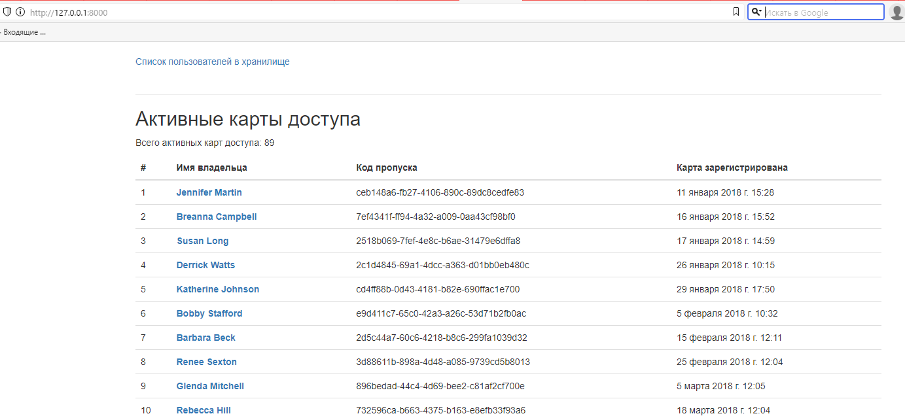

#  Пульт охраны банка
### Описание
Модуль для отслеживания сотрудников банка, используюшие электронные пропуски, модуль может отображать список активных <br>
пропусков, отображает все визиты и длительность пребывания в хранилище по выбранному пропуску, также отображает есть ли <br>
подозрительные пребывания в хранилище (превышаюшие по времени более 60 минут).
### Технологии
Python 3.10,
Django 3.2
### Установка и запуск
- Установите зависимости из файла requirements.txt
```
pip install -r requirements.txt
```
- В папке с файлом main.py выполните команду:
```
python3 main.py runserver
```
- Пример запуска:

### Авторы
dvmn.org и подопытный
